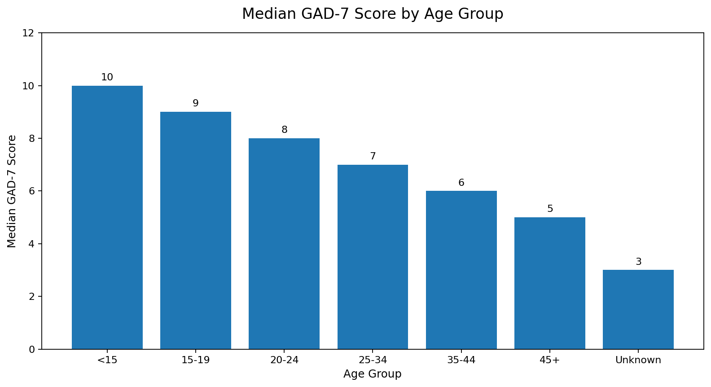
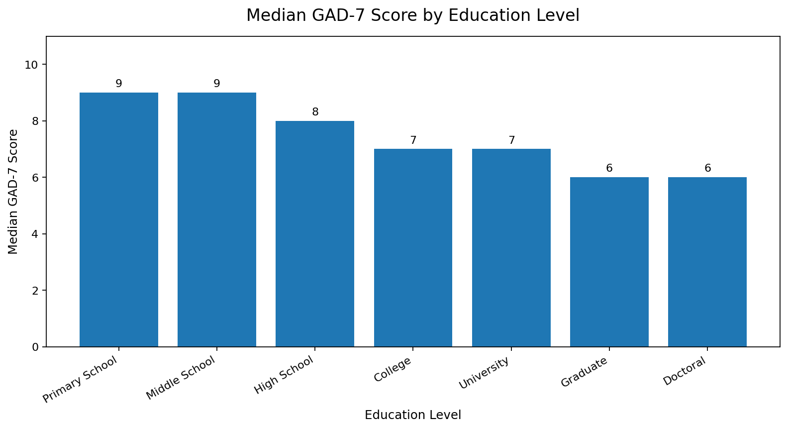
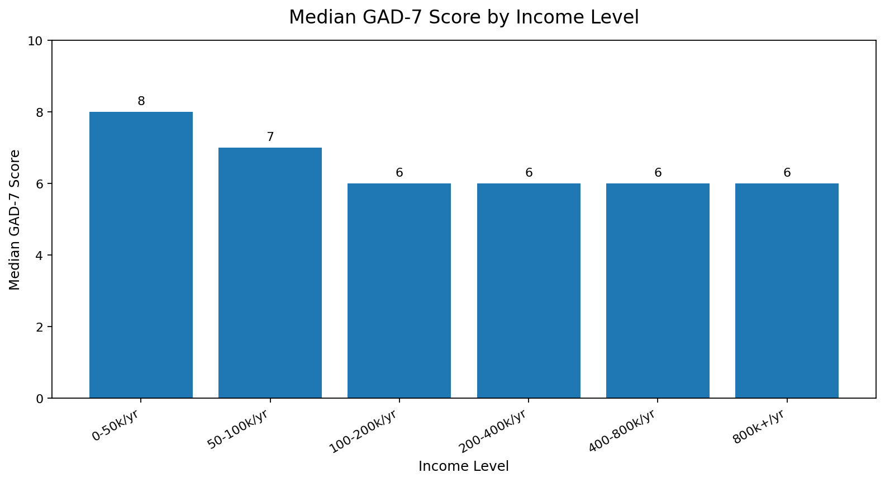
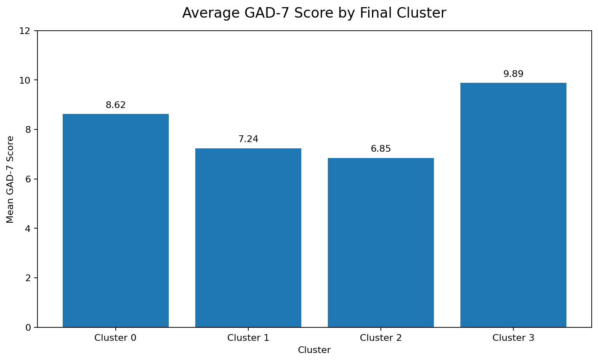
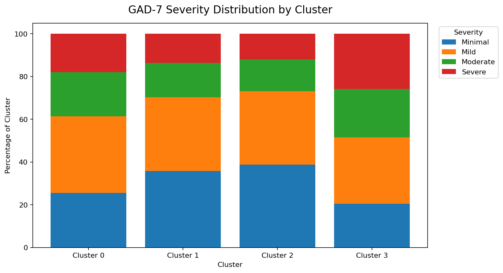

# GAD7 Anxiety Severity Analytics

## Project Overview

This project analyzes GAD-7 survey data to understand how demographic and socioeconomic factors are associated with anxiety severity. The project combines **SQL-based data preparation**, **Python statistical analysis**, **regression modeling**, **sensitivity analysis**, and **clustering** to identify meaningful anxiety-risk patterns across respondent groups.

The goal is to present a reproducible healthcare / public health analytics workflow that moves from raw survey data cleaning to interpretable findings about anxiety burden.

## Research Question

**How are demographic and socioeconomic characteristics associated with GAD-7 anxiety severity?**

The analysis focuses on factors such as:

- Age
- Gender
- Marital status
- Education level
- Income level
- Occupation

The main outcome variable is the **total GAD-7 score**, which is also used to classify anxiety severity categories.

## Why This Project Matters

Mental health survey data can help analysts understand which groups may experience higher anxiety burden. Although this project does not make causal claims, it demonstrates how structured survey analysis can support:

- Demographic risk profiling
- Public health reporting
- Healthcare data analysis
- Survey-based statistical modeling
- Targeted interpretation of anxiety severity patterns

## Dataset

The dataset is based on GAD-7 questionnaire responses and includes:

| Data Type | Description |
|---|---|
| Demographic variables | Age, gender, marital status |
| Socioeconomic variables | Education, income, occupation |
| GAD-7 item responses | Individual questionnaire item scores |
| GAD-7 total score | Main anxiety severity outcome |

The total GAD-7 score is used as the primary dependent variable for statistical testing, regression modeling, and subgroup comparison.

## Tools Used

| Category | Tools |
|---|---|
| Database / Querying | MySQL, SQL |
| Data Analysis | Python, pandas, numpy |
| Statistical Testing | scipy |
| Modeling | scikit-learn |
| Visualization | matplotlib |
| Notebook Analysis | Jupyter Notebook |
| Version Control | GitHub |

## Project Structure

```text
GAD7-Anxiety-Severity-Data-Analysis/
│
├── .gitignore
├── README.md
├── requirements.txt
│
├── reports
|   └── figures
|
├── sql/
│   ├── 01_data_cleaning.sql
│   ├── 02_demographics.sql
│   └── 03_bivariate_analysis.sql
│
└── notebooks/
    ├── 04_bivariate_analysis_continued.ipynb
    ├── 05_sensitivity_analysis.ipynb
    ├── 06_regression_model.ipynb
    └── 07_cluster_analysis.ipynb
```

## Analysis Workflow

### 1. Data Cleaning with SQL

File:

```text
01_data_cleaning.sql
```

Main steps:

- Created the database and analysis table
- Imported survey data
- Checked missing values
- Standardized variable formats
- Prepared the dataset for demographic and anxiety-score analysis

### 2. Demographic Descriptive Analysis

File:

```text
02_demographics.sql
```

Main outputs:

- Sample size
- Gender distribution
- Age distribution
- Marital status distribution
- Education distribution
- Income distribution
- Occupation distribution
- Summary statistics for GAD-7 score

### 3. Bivariate Analysis

Files:

```text
03_bivariate_analysis.sql
04_bivariate_analysis_continued.ipynb
```

The bivariate analysis compares anxiety scores across demographic and socioeconomic groups.

Methods include:

- Grouped SQL summary tables
- Mean, median, minimum, maximum, and standard deviation comparison
- Mann-Whitney U test
- Kruskal-Wallis test
- Continuous age vs. anxiety score analysis

### 4. Sensitivity Analysis

File:

```text
05_sensitivity_analysis.ipynb
```

The sensitivity analysis tests whether conclusions remain stable under different variable grouping strategies.

Examples include:

- Alternative age grouping methods
- Ordered trend analysis
- Different demographic category definitions
- Comparison of result stability across grouping choices

### 5. Regression Modeling

File:

```text
06_regression_model.ipynb
```

Regression models are used to evaluate associations between demographic factors and GAD-7 anxiety score.

Main steps:

- Selected candidate predictors
- Built regression models
- Interpreted coefficients
- Compared model specifications
- Identified variables associated with higher or lower anxiety severity

### 6. Clustering Analysis

File:

```text
07_cluster_analysis.ipynb
```

The clustering analysis identifies demographic and socioeconomic subgroups in the sample.

Main process:

- Tested different encoding strategies
- Compared clustering quality using silhouette score
- Selected a final 4-cluster solution
- Profiled each cluster by demographic characteristics
- Compared GAD-7 score and anxiety severity across clusters

## Clustering Summary

Several clustering approaches were tested. Earlier versions showed that clusters could be overly driven by individual variables such as gender or education.

To improve interpretability, the final model used an **ordinal-aware encoding strategy**:

- Age, income, and education were treated as ordered or continuous variables
- Gender was kept as a binary variable
- Marital status was one-hot encoded

A **4-cluster solution** was selected based on:

- Silhouette score
- Cluster size balance
- Interpretability
- Meaningful differences in anxiety burden

The final clustering results suggest that demographic and socioeconomic profiles are meaningfully related to anxiety severity.

## Visual Results

### GAD-7 Score by Age Group



Younger respondents show higher median GAD-7 scores, suggesting that anxiety burden is more concentrated among younger age groups in this sample.

### GAD-7 Score by Education Level



Median GAD-7 scores are generally lower among respondents with higher education levels, suggesting a potential association between education and lower anxiety burden.

### GAD-7 Score by Income Level



Lower-income respondents show higher median GAD-7 scores, while middle- and higher-income groups have relatively similar median scores.

### Average GAD-7 Score by Cluster



The final clustering model identifies distinct demographic profiles with significantly different anxiety burdens, with Cluster 3 showing the highest average GAD-7 score.

### GAD-7 Severity Distribution by Cluster



The severity distribution further shows that clusters differ not only in average score, but also in the share of respondents classified as moderate or severe.

## Key Findings

Main findings from the analysis include:

- Anxiety severity differs across demographic and socioeconomic groups.
- Younger and more socioeconomically disadvantaged respondents tend to show higher anxiety burden.
- Higher education, higher income, and more stable marital status are generally associated with lower anxiety burden.
- Regression modeling supports the relationship between selected demographic factors and GAD-7 score.
- Clustering analysis identifies distinct respondent profiles with different anxiety severity patterns.

## Limitations

This project has several important limitations:

- The dataset is observational, so causal conclusions cannot be made.
- Self-reported survey responses may contain response bias.
- Clustering results can vary depending on preprocessing and encoding choices.
- Some demographic variables may lose detail when grouped into broader categories.
- Additional validation would be needed before applying findings to real-world clinical or policy decisions.

## Future Improvements

Potential next steps:

- Add symptom-level clustering using individual GAD-7 item responses
- Add post-hoc pairwise comparisons after overall significance tests
- Improve visualization and add charts to the README
- Compare regression and clustering findings more directly
- Add a reproducible Python environment file
- Reorganize SQL and notebooks into dedicated folders
- Add an executive summary report

## Skills Demonstrated

This project demonstrates:

- SQL data cleaning and survey data preparation
- Descriptive demographic analysis
- Bivariate statistical analysis
- Non-parametric hypothesis testing
- Sensitivity analysis
- Regression modeling
- Clustering and subgroup profiling
- Healthcare / public health analytics interpretation
- GitHub documentation and reproducible project organization

## Author Note

This project was built as a step-by-step data analysis practice project combining SQL, Python, statistics, modeling, and healthcare-oriented data interpretation.
